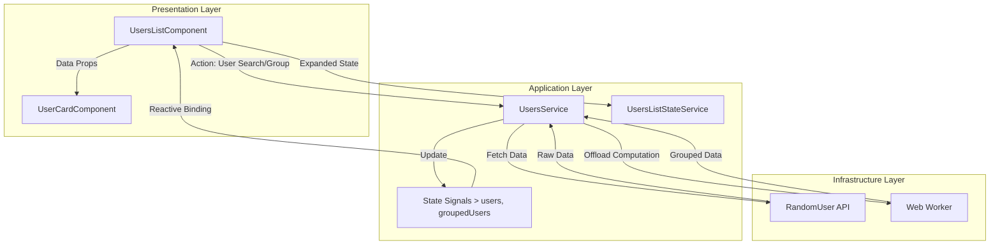

# User Management – Design & Rationale

This document explains **what the User Visualizer does**, **how it works**, and most importantly: **why certain technical decisions were made**. It’s written to be understandable whether you’re skimming at a high level or digging into implementation details.

The goal of this feature is simple: **make it easy and fast to explore a large list of users without the UI ever feeling slow or fragile**.

---

## 1. What This Feature Does (Big Picture)

The User Visualizer application allows users to:

* Browse **thousands of user records** smoothly
* Scroll endlessly without manual pagination
* Group users by different criteria (age, nationality, etc.)
* Instantly search through the dataset

All of this happens **without freezing the UI**, even when working with 5,000+ records.

To achieve that, the application is built with **Angular 20**, using **Signals** for reactive state management and **Web Workers** to handle heavy computation off the main thread.

---

## 2. Core Design Philosophy

Before diving into individual techniques, it helps to understand the guiding principles behind the implementation:

* **Responsiveness first** – The UI should never block, stutter, or lag
* **Predictable data flow** – State changes should be easy to trace and reason about
* **Clear separation of concerns** – UI, state, and computation each have their own place
* **Future-proof Angular patterns** – Lean into Signals and zoneless-ready architecture

Every technical decision below maps back to at least one of these goals.

---

## 3. State Management with Angular Signals

At the heart of the application is `UsersService`, which acts as the **single source of truth** for user-related data.

Instead of spreading state across components, all core data lives in Signals:

* the full user list
* the active search query
* the selected grouping criteria
* derived representations of that data

### Why Signals?

Signals were chosen because they naturally solve several problems at once:

* **Efficient updates**
  Only the parts of the UI that depend on changed data are re-rendered. This avoids unnecessary change detection cycles and keeps rendering fast.

* **Readable derived state**
  Things like filtered users or `flattened` lists are implemented as `computed` signals. This means they update automatically when their inputs change—no manual subscriptions, no hidden side effects.

* **Alignment with Angular’s future**
  Signals are designed to work without `Zone.js`, so the architecture is compatible with where Angular is heading.

In short, Signals allow the data flow to stay **declarative, predictable, and performant**.
In this project there was no need of complex state management, since the application is not complex and a pragmatic approach was chosen.

---

## 4. Keeping the UI Fast with Web Workers

Grouping thousands of users by a given property (age, nationality, etc.) is not a trivial operation. Doing this work on the main thread would cause noticeable UI freezes—especially during scrolling or typing.

### The Problem

* Sorting and grouping large arrays is CPU intensive
* Running that logic on the main thread blocks the UI rendering and and by consequence any user interaction

### The Solution: Web Workers

Heavy data transformations are offloaded to a background thread using a Web Worker:

* **File:** `grouping.worker.ts`
* When the user selects a grouping option, the raw dataset is sent to the worker
* The worker performs sorting and grouping
* The processed result is sent back to the main thread

### Why This Matters

This approach ensures that:

* Scrolling remains smooth
* Search input stays responsive
* The UI never feels “locked” while data is being processed

From the user’s perspective, everything feels instant—even though complex work is happening behind the scenes.

---

## 5. Infinite Scroll & Rendering Strategy

Rendering thousands of DOM nodes at once is expensive and actually.. unnecessary, most of them are never visible on screen and probably the user will never scroll that far. 

### The Approach

The application combines **infinite scrolling** with **progressive rendering**:

* Only a subset of users is rendered at any given time
* Additional users are appended as the user scrolls
* A small buffer ensures scrolling feels continuous

### How It Works

* A flattened list (group headers + user cards) is maintained in memory
* The DOM renders only what’s currently needed
* An invisible **sentinel element** at the bottom of the list is observed using `IntersectionObserver`
* When the sentinel enters the viewport, the next chunk of items is loaded

### Benefit

This keeps memory usage low and rendering fast, while still giving the illusion of a fully loaded list.

---

## 6. Client-Side Search

Because the dataset is already available locally (either fully or in large chunks), search is handled entirely on the client. 
Relevant Note: The most optimal decision will always be to work with the backend as the primary source of truth and let it handle the search.
but since part of the criteria on the coding challenge has been to work with the data locally, this decision has been made like that.

### Why Client-Side?

* No network latency on every keystroke
* Instant feedback while typing
* Simpler mental model for search behavior

### How It’s Implemented

* A `searchQuery` signal stores the current input
* A `computed` signal filters the user list based on that query
* Any change to the query automatically updates the visible results

This keeps search fast, simple, and easy to reason about.

---

## 7. Key Building Blocks

| Component / Service     | Purpose                                                                                                |
| ----------------------- | ------------------------------------------------------------------------------------------------------ |
| `UsersService`          | Central state container. Handles data fetching, Signals, grouping logic, and Web Worker orchestration. |
| `UsersListComponent`    | Smart container. Connects UI to the service, manages scrolling behavior, and renders the list.         |
| `UsersListStateService` | Manages temporary UI state (expanded cards, UI-only flags) to keep business logic clean.               |
| `UserCardComponent`     | Presentation-only component for displaying individual user details.                                    |

---

## 8. Folder Structure (At a Glance)

```
src/app/features/users/
├── components/
│   ├── users-list/        # Main list container
│   └── user-card/         # Individual user UI
├── services/
│   ├── users.service.ts               # Core data & logic
│   └── users-list-state.service.ts    # UI-only state
└── models/                # Domain models (User, API types)

src/app/workers/
└── grouping.worker.ts     # Background data processing
```

This structure keeps responsibilities clear and makes it easy to locate logic.

---

## 9. Clean Architecture (A Pragmatic Version)

The application follows a **practical interpretation of Clean Architecture**—focused on clarity and maintainability rather than strict academic rules.

### Presentation Layer (UI)

* Responsible for rendering and user interaction
* Contains Angular components only
* No business logic

### Application Layer (Services)

* Orchestrates data flow and use cases
* Holds reactive state via Signals
* Bridges UI and infrastructure

### Domain Layer (Models)

* Pure TypeScript interfaces
* No Angular or framework dependencies
* Represents core business entities

### Infrastructure Layer

* Handles external systems and heavy work
* API communication
* Web Worker computation

Each layer has a clear role, making the codebase easier to understand, test, and extend.

---

## 10. System Flow Overview

At a high level:

* UI components react to user input
* Services update Signals
* Derived state recalculates automatically
* Heavy computation runs in the background
* The UI updates reactively without manual wiring

This results in a system that feels smooth to use and remains straightforward to maintain.

## 6. System Overview

The following diagram illustrates the data flow and interaction between the layers:


